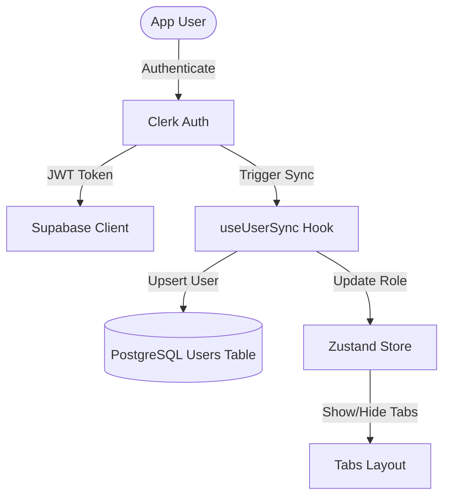

# 🏠 Kribb — Real Estate App

> A premium full-stack real estate mobile application built using **React Native**, **Expo**, **TypeScript**, and **NativeWind**. Based on the **JavaScript Mastery React Native 2026** course.

---

## 🛠️ Technology Stack

| Component | Technology | Description |
| :--- | :--- | :--- |
| **Framework** | 📱 [Expo v54](https://docs.expo.dev/versions/v54.0.0/) | Universal React Native development |
| **Routing** | 🗺️ [Expo Router](https://docs.expo.dev/router/introduction/) | Clean, file-based routing |
| **Styling** | 🎨 [NativeWind v4](https://www.nativewind.dev/) | Tailwind CSS for native React Native apps |
| **Authentication** | 🔑 [Clerk](https://clerk.com/) | Secure user signup, login, and sessions |
| **Database** | ⚡ [Supabase](https://supabase.com/) | PostgreSQL backend, storage, and RLS |
| **State** | 🧠 [Zustand](https://github.com/pmndrs/zustand) | Light-weight client state management |

---

## 🚦 Current Project Status

We have completed the foundational architecture, authentication integration, and user-to-database synchronization.



### Module Status & Files

| Feature | Status | Core Files |
| :--- | :---: | :--- |
| **Auth Pages** | 🟢 Done | [sign-in.tsx](file:///D:/projects/building/test/app/(auth)/sign-in.tsx), [sign-up.tsx](file:///D:/projects/building/test/app/(auth)/sign-up.tsx) |
| **Navigation Shell** | 🟢 Done | [_layout.tsx](file:///D:/projects/building/test/app/(roots)/(tabs)/_layout.tsx), [_layout.tsx](file:///D:/projects/building/test/app/(roots)/_layout.tsx) |
| **Supabase Client** | 🟢 Done | [supabase.ts](file:///D:/projects/building/test/lib/supabase.ts) (Attaches Clerk JWT) |
| **User Sync Hook** | 🟢 Done | [useUserSync.ts](file:///D:/projects/building/test/hooks/useUserSync.ts), [useSupabase.ts](file:///D:/projects/building/test/hooks/useSupabase.ts) |
| **Role Management** | 🟢 Done | [userStore.ts](file:///D:/projects/building/test/store/userStore.ts) (Checks Admin) |
| **Home Screen** | 🟡 Placeholder | [index.tsx](file:///D:/projects/building/test/app/(roots)/(tabs)/index.tsx) |
| **Search & Saved** | 🟡 Placeholder | [search.tsx](file:///D:/projects/building/test/app/(roots)/(tabs)/search.tsx), [saved.tsx](file:///D:/projects/building/test/app/(roots)/(tabs)/saved.tsx) |
| **Create Property** | 🟡 Placeholder | [create.tsx](file:///D:/projects/building/test/app/(roots)/(tabs)/create.tsx) (Admin Only) |

---

## 🎯 Next Steps Checklist

### 📋 Phase 1: Database & Seed Data
- [ ] **Create Tables in Supabase**: Setup `agents`, `properties`, `reviews`, and `favorites` tables.
- [ ] **Configure RLS**: Enable Row-Level Security policies to protect data access.
- [ ] **Database Seeding**: Insert mock data for properties and agents to preview the design.

### 🎨 Phase 2: Rich UI Layouts
- [ ] **Home Screen (Featured & Grid)**:
  - [ ] Implement header, search bar, and category filters.
  - [ ] Implement *Featured Properties* horizontal carousel card.
  - [ ] Implement *Recent Properties* vertical grid cards.
- [ ] **Property Detail Screen** (Create `app/properties/[id].tsx`):
  - [ ] Design image carousel, location description, agent profile, reviews, and Map preview.
- [ ] **Search & Filter Views**: Implement dynamic queries and search filtering.

### 🔌 Phase 3: Interactive Features
- [ ] **Favorites**: Toggle heart buttons on property cards to save/remove listings.
- [ ] **Map Integration**: Setup `react-native-maps` for coordinate selection.
- [ ] **Contact Agent**: Set up calling/SMS/WhatsApp deep linking actions.
- [ ] **Admin Creator Flow**: Build forms in `create.tsx` for listings and image uploads.

---

## ⚡ Quick Start

### 1. Installation
```bash
npm install
```

### 2. Environment Variables (`.env`)
Create a local `.env` file (which is safely ignored by Git):
```env
EXPO_PUBLIC_CLERK_PUBLISHABLE_KEY=pk_test_...
EXPO_PUBLIC_SUPABASE_URL=https://...
EXPO_PUBLIC_SUPABASE_KEY=sb_...
```

### 3. Run Development Server
```bash
npx expo start
```
